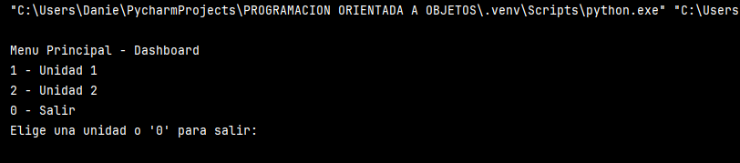
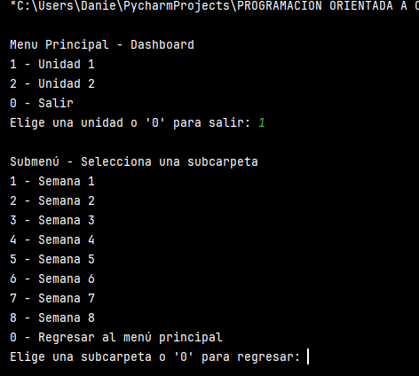
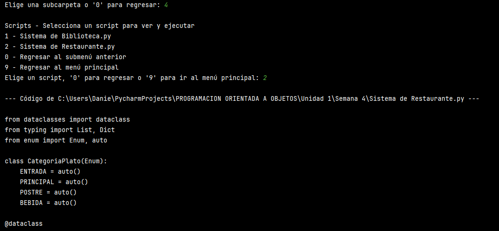
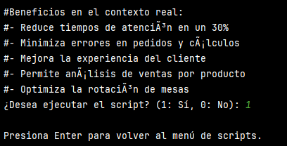
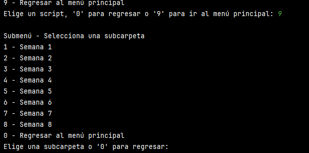
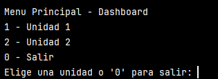

Evidencia del funcionamiento del archivo Dashboard.py correspondiente a la  
Unidad 1--> 
            Semana 1 
            Semana 2 
            Semana 3 
            Semana 4 
            Semana 5 
            Semana 6 
            Semana 7 
            Semana 8 

<b>Evidencia 1 </b>
Se inicia la navegación del Dashboard

<b>Evidencia 2 </b>
Ya se ejecuta el código desplegando las semanas dee cada unidad

<b>Evidencia 3 </b>
Ya seleccionada la semana se muestran los archivos de la carpeta

<b>Evidencia 4 </b>
Ya seleccionado el programa, se ejecuta y se visualiza el código

<b>Evidencia 5 </b>
Se selecciona si se quiere ejecutar el programa o no

<b>Evidencia 6 </b>
Una vez ejecutado el programa se regresa la menu principal

<b>Evidencia 7 </b>
Regresamos el menu inicial

